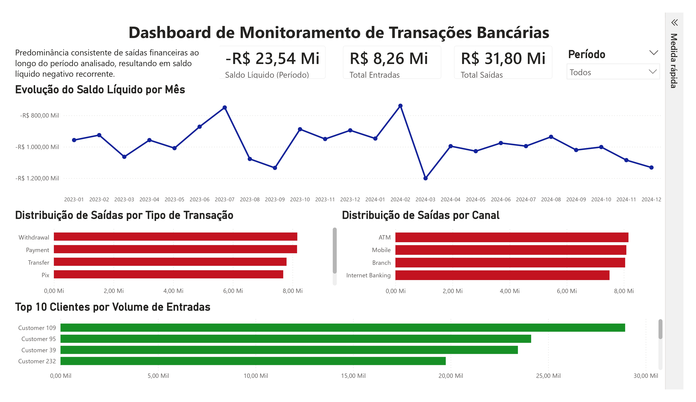

# Data Warehouse Bancário & Dashboard de Monitoramento de Transações

## Visão Geral

Este projeto simula um ambiente real de dados bancários, construindo um pipeline completo desde a geração de dados até a visualização final.

O objetivo é transformar dados transacionais brutos em informações estruturadas e insights de negócio por meio de modelagem dimensional, consultas SQL e visualização em Power BI.

---

## Arquitetura do Projeto

O fluxo de dados segue a seguinte estrutura:

Dados Brutos → ETL (Python) → Banco SQLite → Modelo Dimensional → Dashboard no Power BI

---

## Modelagem de Dados

Foi implementado um modelo dimensional (Star Schema), amplamente utilizado em ambientes corporativos para análise de dados.

### Tabela Fato

* fact_transactions: armazena eventos transacionais e métricas financeiras

### Tabelas Dimensão

* dim_customers: informações de clientes
* dim_accounts: dados das contas
* dim_branches: dados das agências
* dim_date: dimensão temporal

Essa estrutura separa métricas de contexto, facilitando análises, melhorando performance e garantindo escalabilidade.

---

## Pipeline de Dados

O pipeline inclui:

* Geração de dados sintéticos com Python
* Ingestão dos dados em banco SQLite
* Transformação para modelo dimensional via SQL
* Consultas analíticas para exploração dos dados

---

## Principais Métricas

O dashboard foi estruturado com foco em três indicadores principais:

* Total de Entradas
* Total de Saídas
* Saldo Líquido

---

## Dashboard



O dashboard em Power BI apresenta uma visão analítica do comportamento financeiro.

### Principais Visualizações

* Evolução mensal do saldo líquido
* Distribuição de saídas por tipo de transação
* Distribuição de saídas por canal
* Top 10 clientes por volume de entradas

### Insight de Negócio

A análise evidencia uma predominância consistente de saídas financeiras ao longo do período analisado, resultando em saldo líquido negativo recorrente.

---

## Dashboard Interativo

O arquivo do dashboard em Power BI está disponível no repositório:

dashboard/dashboard-banking.pbix

Para visualizar de forma interativa:

1. Faça o download do arquivo
2. Abra no Power BI Desktop

---

## Tecnologias Utilizadas

* Python (pandas)
* SQL (SQLite)
* Power BI
* Modelagem de Dados (Star Schema)
* Conceitos de ETL

---

## Estrutura do Projeto

```
banking-data-warehouse/
│
├── data/
│   ├── raw/
│   └── processed/
│
├── scripts/
│   ├── generate_banking_data.py
│   ├── load_to_sqlite.py
│   └── run_sql_file.py
│
├── sql/
│   ├── 01_create_dw_tables.sql
│   ├── 02_analytical_queries.sql
│
├── dashboard/
│   ├── dashboard-banking.jpg
│   └── dashboard-banking.pbix
│
├── banking.db
│
└── README.md
```

---

## Como Executar

1. Gerar os dados:

```
python scripts/generate_banking_data.py
```

2. Carregar no banco:

```
python scripts/load_to_sqlite.py
```

3. Criar o modelo dimensional:

```
python scripts/run_sql_file.py sql/01_create_dw_tables.sql
```

---

## Aprendizados

* Modelagem dimensional (fato e dimensões)
* Estruturação de dados para análise
* Consultas SQL aplicadas a problemas de negócio
* Construção de dashboards analíticos
* Integração entre engenharia e análise de dados

---

## Autora

Aline Bastos Brasil
Analista de Dados | SQL | Python | Power BI | ETL & Data Pipelines

LinkedIn: https://www.linkedin.com/in/alinebbrasildata/
